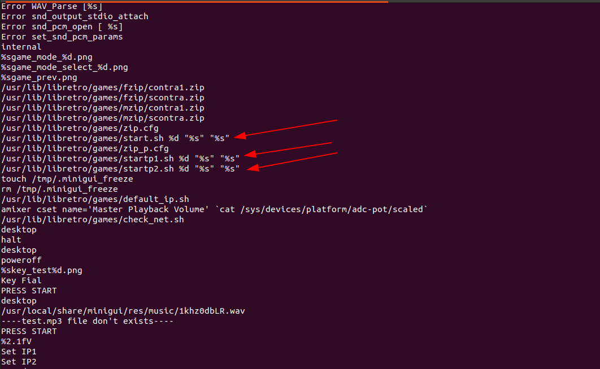
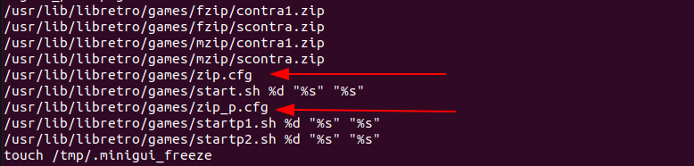
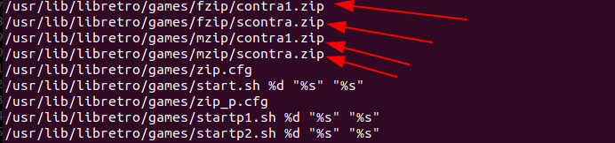
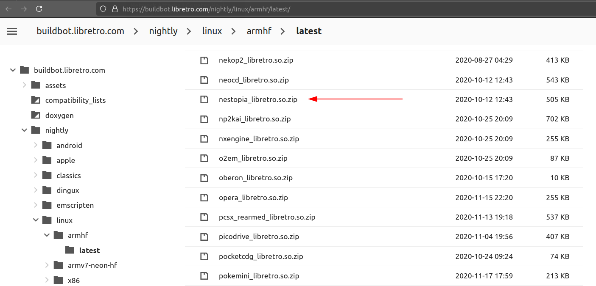
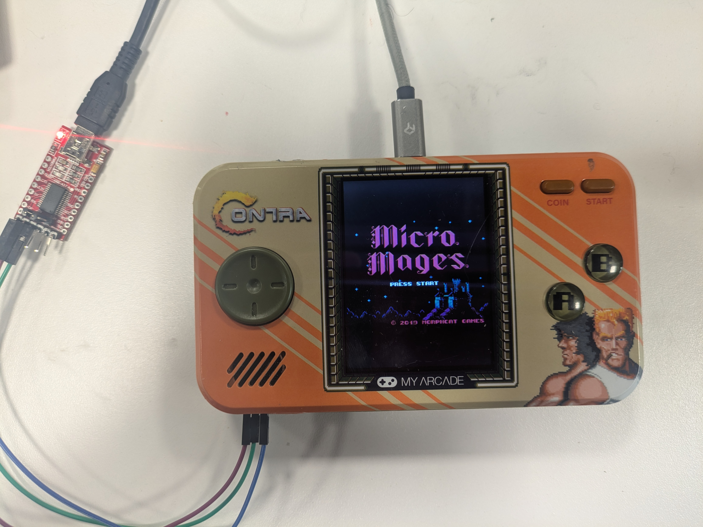
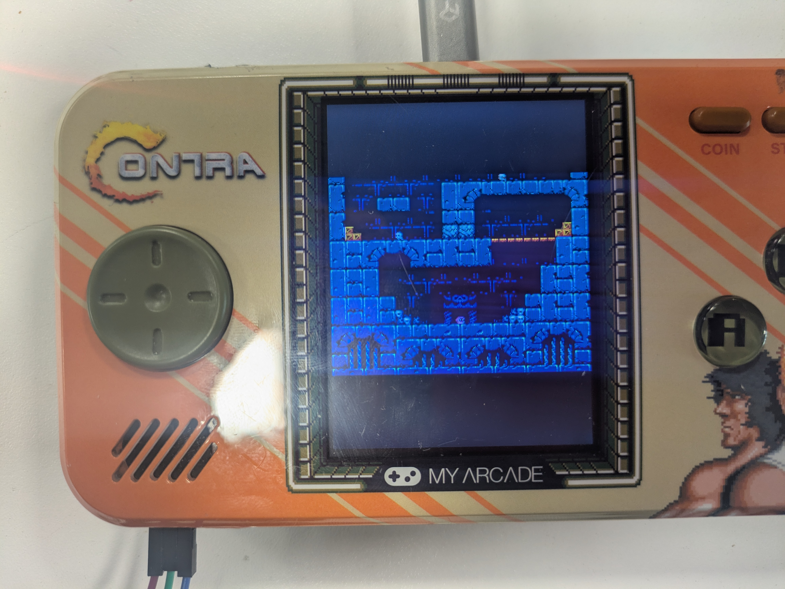
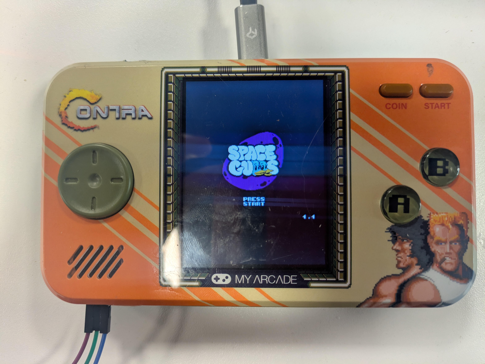
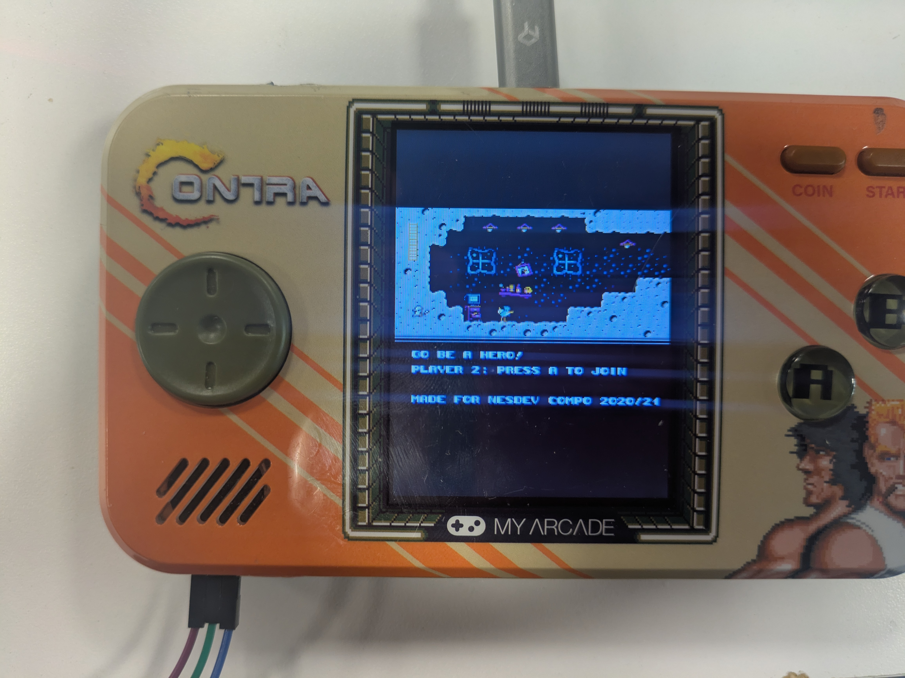

# Adding ROMs and Emulators

This article assumes you have read the [Reading From Flash Memory](ReadingFlash.md) guide and the [Writing to Flash](WritingFlash.md) guide. ~~If you're confident in your soldering skills you can read the [Setup Serial Terminal](SetupSerialTerminal.md) guide~~. If you're confident in your hex editor skills, give the [USB Debug Mode](USBDebug.md) guide a read. This will give you an interactive terminal on the PC that controls the console which will make debugging issues on the console way easier.


## Contra Console Game System
Poking around the `etc/init.d` we can see some startup scripts that run when the console boots. For us the file  

`etc/init.d/S50ui`

is of particular intertest. Around line 29 of `etc/init.d/S50ui` we see the following commands
```bash
if [ `cat /sys/class/drm/card0-HDMI-A-1/status` == "connected" ]; then
	export MG_CFG_PATH=/usr/local/share/minigui_720p
	/usr/bin/game_720p &
      else
	export MG_CFG_PATH=/etc
	/usr/bin/game &

/usr/bin/game &
```

The line 
```bash
/usr/bin/game &
```
is what boots the Contra game select application where users can select the Contra version (Contra, Super Contra) and the number of players (1 or 2 players).


## Analyzing the Game Application
If we run `strings usr/bin/game` we can get a list of all strings within the `game` binary. This can tell us what commands are being used to load the Contra games. Three strings are of particular interest:



```
/usr/lib/libretro/games/start.sh %d "%s" "%s"
/usr/lib/libretro/games/startp1.sh %d "%s" "%s"
/usr/lib/libretro/games/startp2.sh %d "%s" "%s"
```
This looks to be how the `usr/bin/game` binary initiates the Contra game instances. We can verify this by inspecting the three scripts starting with `usr/lib/libretro/start.sh`.

In `usr/lib/libretro/start.sh` we can see it ends by executing

```bash
/usr/bin/retroarch -y "12"\
    -c "$2"\
    -L /usr/lib/libretro/$GAME_LIB "$3"\
```

The Retroarch command has the following form: \
(the `-y "12"` is most likely a parameter for a custom implementation of Retroarch)

```bash
retroarch -y "12" -c <config file> -L <emulator.so> <ROM file>
```

So, to initiate a Contra game instance we will need, the config file, the emulator file, and the ROM file.

Looking at the `usr/bin/game` strings we can see some possible config files



We can also find some possible ROMs listed as `.zip` files. I'm assuming `fzip` stands for **fbalpha** zip ROMs and `mzip` stands for **mame2016** zip ROMs. 



In the `usr/lib/start.sh` file we can see that the emulator being used is

```bash
$GAME_LIB=mame2016_libretro.so 
```

Which is located at `usr/lib/libretro/mame2016_libretro.so`.

## Running ROMs

Now that we have all the information needed to construct a command to initiate an instance of Contra 1 for a single player:

```bash
/usr/bin/retroarch -y "12" -c "/usr/lib/libretro/games/zip.cfg" 
    -L "/usr/lib/libretro/mame2016_libretro.so" "/usr/lib/libretro/games/mzip/contra1.zip"
```

If we wanted to run this command immediately after the console boots, we could modify the `/etc/init.d/S50ui` file by replacing `/usr/bin/game &` with the command above:

(**S50ui** around line 29)
```bash
if [ `cat /sys/class/drm/card0-HDMI-A-1/status` == "connected" ]; then
	export MG_CFG_PATH=/usr/local/share/minigui_720p
	/usr/bin/game_720p &
      else
	export MG_CFG_PATH=/etc
	/usr/bin/game &

/usr/bin/game &
```

(modified **S50ui** around line 29)
```bash
if [ `cat /sys/class/drm/card0-HDMI-A-1/status` == "connected" ]; then
	export MG_CFG_PATH=/usr/local/share/minigui_720p
	/usr/bin/game_720p &
      else
	export MG_CFG_PATH=/etc
	/usr/bin/retroarch -y "12" -c "/usr/lib/libretro/games/zip.cfg" 
    -L "/usr/lib/libretro/mame2016_libretro.so" "/usr/lib/libretro/games/mzip/contra1.zip" &

/usr/bin/retroarch -y "12" -c "/usr/lib/libretro/games/zip.cfg" 
    -L "/usr/lib/libretro/mame2016_libretro.so" "/usr/lib/libretro/games/mzip/contra1.zip" &
```

Now, when the console boots, it should immediately run Contra for single player using the mame 2016 emulator.

## Adding Emulators
If we want to add other emulators, we need to find their shared object files `<emulator>.so`. Finding these files is a bit tricky. After some digging (checking for `buildbot` urls listed in the console's filesystem) I found a [link](https://buildbot.libretro.com/nightly/linux/armhf/latest/) to a repository of compiled emulator binaries that may work on this console.



So far I have been able to get the [nestopia]() and [dosbox]() emulators to work on this (dosbox can even run DOOM however, the input mappings need to be fixed). Currently we are using precompiled binaries from the `nightly > linux > armhf > latest` list however since the **RK3128** contains an Arm7 chip with a neon FPU and Hardware Float (HF) we should also be able to use some precompiled binaries from the `nightly > linux > armv7-neon-hf > latest` list.

After downloading the `<emulator.so>` (*ex.* nestopia.so) we can move that file to the same directory (`usr/lib/libretro`) as the the **fbalpha** and **mame2016** emulators in. Now you can run NES ROMs. [itch.io](itch.io) has some homebrew NES games made by some awesome devs and studios like Morphcat Games. Personally I tried the [Space Gulls](https://morphcatgames.itch.io/spacegulls) game and the [Micro Mages](http://morphcat.de/micromages/) NES  games (both made by Morphcat Games).

For example, to run Micro Mages (I have the `MicroMages.nes` ROM installed at `/usr/lib/libretro/games/nes/MicroMages.nes`) I would use the command:
```bash
/usr/bin/retroarch -y "12" -c "/usr/lib/libretro/games/zip.cfg" 
    -L "/usr/lib/libretro/nestopia_libretro.so" "/usr/lib/libretro/games/nes/MicroMages.nes"
```


So, to run Micro Mages immediately after booting up, I would modify the `/etc/init.d/S50ui` file (around line 29) from:
```bash
if [ `cat /sys/class/drm/card0-HDMI-A-1/status` == "connected" ]; then
	export MG_CFG_PATH=/usr/local/share/minigui_720p
	/usr/bin/game_720p &
      else
	export MG_CFG_PATH=/etc
	/usr/bin/game &

/usr/bin/game &
```

to the following

```bash

if [ `cat /sys/class/drm/card0-HDMI-A-1/status` == "connected" ]; then
	export MG_CFG_PATH=/usr/local/share/minigui_720p
	/usr/bin/game_720p &
      else
	export MG_CFG_PATH=/etc
	/usr/bin/retroarch -y "12" -c "/usr/lib/libretro/games/zip.cfg" 
    -L "/usr/lib/libretro/nestopia_libretro.so" "/usr/lib/libretro/games/nes/MicroMages.nes" &

/usr/bin/retroarch -y "12" -c "/usr/lib/libretro/games/zip.cfg" 
    -L "/usr/lib/libretro/nestopia_libretro.so" "/usr/lib/libretro/games/nes/MicroMages.nes" &
```





The Homebrew [Space Gulls](https://morphcatgames.itch.io/spacegulls) game also runs on the **nestopia** emulator:



<div style="display: flex; justify-content: space-between;">
  <a href="WritingFlash.md" style="text-decoration: none; padding: 10px 20px; background-color: #007BFF; color: white; border-radius: 5px;">&larr; Writing to Flash</a>
  <a href="USBDebug.md" style="text-decoration: none; padding: 10px 20px; background-color: #007BFF; color: white; border-radius: 5px;">USB Debug Mode &rarr;</a>
</div>
