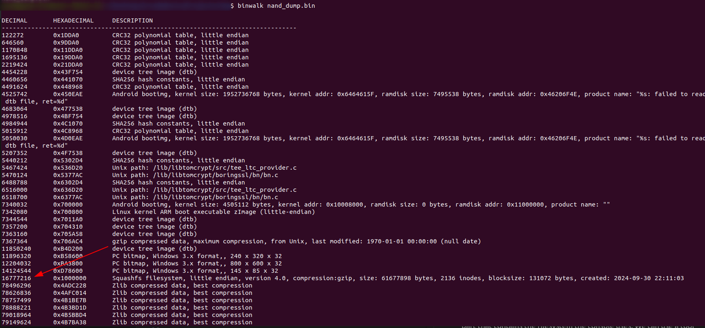
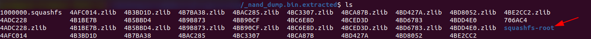
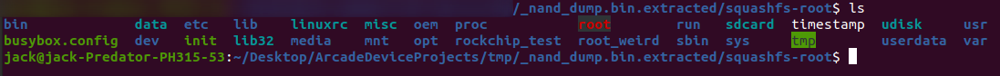

# Reading From Flash Memory

I highly recommend reading the [article](https://trustedsec.com/blog/hacking-the-my-arcade-contra-pocket-player-part-i) I mentioned in the introduction. It does a much better job explaining the inner workings of the MyArcade Contra Console and the process of reading flash memory. This guide will be pulling most of its information from that article.

## Enabling Mask ROM Mode
A cool property of some Rockchip chips is that we can enable its recovery mode by sending the Volume Up (as in sound volume) signal to the chip during its boot sequence. Since the MyArcade Contra Console uses an RK3128 (Rockchip 3218) we can enable its recovery mode by holding down the **Volume Up** button during the boot sequence of the console. This will put the chip in **Mask ROM Mode** allowing us to ask it for Flash memory.

## Reading the Flash
Now that the console is in **Mask ROM Mode** we can ask the **RK3128** very nicely for its flash memory. We must install the `rkflashtool` application to read/write the flash memory to the console. We will also need a USB cable to connect a PC to the Console through the console's micro USB female port.

To get a dump of the flash memory we'll use the command:


```bash
sudo rkflashtool r 0 262144 > ~/Desktop/nand_dumps/nand_dump.bin
```
(I am copying this command from this [article](https://trustedsec.com/blog/hacking-the-my-arcade-contra-pocket-player-part-i))

We have now reached the end of the content from the [article](https://trustedsec.com/blog/hacking-the-my-arcade-contra-pocket-player-part-i). Going forward, any presented information will probably be my own findings from messing around with this console.

Now that we have a dump of the entire flash memory, we find the part that contains the filesystem the console uses. We can use a tool like `binwalk` to analyze and separate the **nand_dump.bin** binary.

```bash
binwalk -e ~/Desktop/nand_dumps/nand_dump.bin
```



Your output will not match this exactly (this is a `binwalk` analysis of the current NAND Flash in my Console which is heavily modified). What's important is the address of the **squashfs** filesystem which is 16777216 (I'm assuming this address will be the same for anyone's MyArcade Console), we'll need this later. The `binwalk` program will extract all files into a `_nand_dump_bin.extracted` folder (your extracted files will not look like mine since I have modified my console's filesystem memory). 



Change directory into the `squashfs-root`. We should see a directory similar to this.



We can now dive into the filesystem and check the available programs (`usr/bin` has some interesting programs). For this guide, we are interested in the `usr/lib/libretro` folder. This contains the emulators and games available on the console. We should see the following emulators

1. `fbalpha_libretro.so`
2. `mame2016_libretro.so`

If we look in the `usr/lib/libretro/games` folder we should see two folders, `fzip` and `mzip`. I know `fzip` contains Contra ROMs for the **fbalpha** emulator which implies that `mzip` contains Contra ROMs for the **mame2016** emulator.

<div style="display: flex; justify-content: space-between;">
  <a href="README.md" style="text-decoration: none; padding: 10px 20px; background-color: #007BFF; color: white; border-radius: 5px;">&larr; Table of Contents</a>
  <a href="WritingFlash.md" style="text-decoration: none; padding: 10px 20px; background-color: #007BFF; color: white; border-radius: 5px;">Writing to Flash &rarr;</a>
</div>