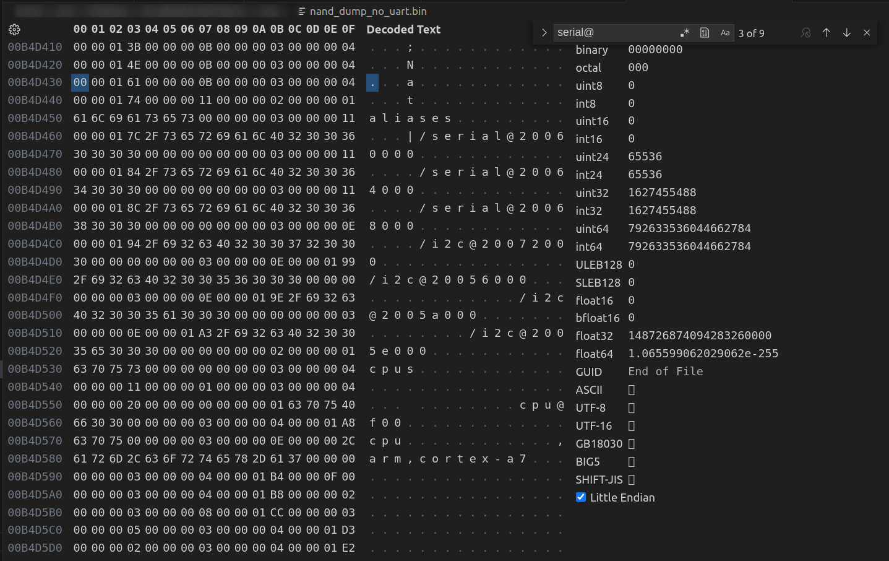
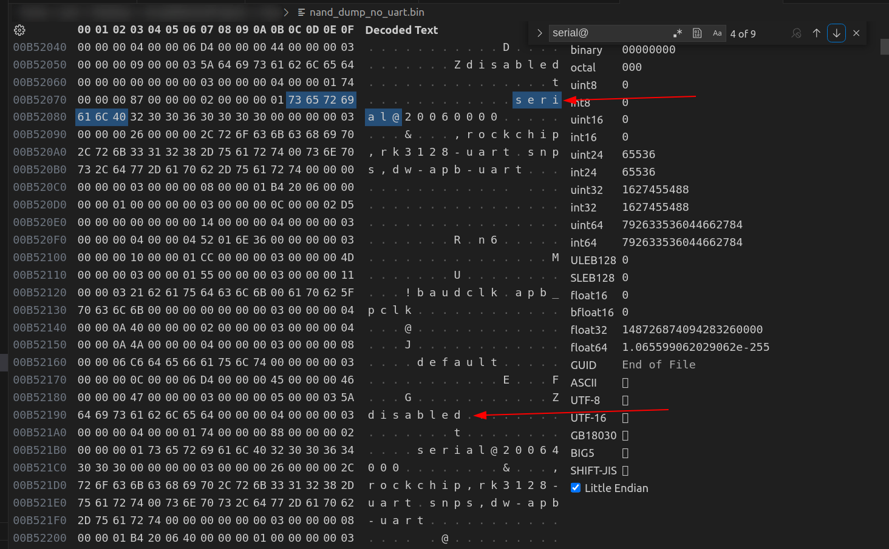
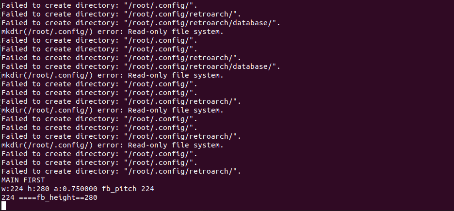

# Setup UART Terminal

Currently our only way to control the console is by providing it commands in the `/etc/init.d/S50ui` file. What would be really nice is to have an interactive terminal on the console so that we can send commands to the console from a separate device. This will also make debugging issues waaayyyy easier.

## Soldering to UART Pins
Solder to the following UART pints. 


To read UART we will need a UART to TTL 


## UART Terminal Settings

Using the `picocom` tool, we can listen to the UART line.
``` bash
# Baud: 115200
# flow: none
# databits: 8
# dtr: up
# rts: up
sudo picocom -b 115200 /dev/ttyUSB0
```

You should now see something similar to this when rebooting the device while UART is connected.


Currently it is not prompting us for a login, to fix that, we need to enable the **serial** devices in the device tree blob (.dtb file).

## Enabling Serial Devices

I will be using the VSCode Hex Editor Extension for the following part.

We'll start by grabbing a dump of the flash memory

```bash
sudo ./rkflashtool r 0 262144 > nand_dump.bin
```

Open the `nand_dump.bin` file using a hex editor. We will now search for the following string "serial@"

The first hit should be a list of **aliases** for serial devices


We don't really need to do anything here so we'll move onto the next match.

At around the 4th match we can see the actual properties of a serial device. In the image below we can see the properties of the `serial@20060000` device. The "disabled" string is what's keeping this serial device
off.


To enable the serial device we need to overwrite the "disabled" with "okay". Be careful not to **insert** characters (this would increase the size `nand_dump.bin` by a few bytes). We want to **overwrite** the "disabled" string with "okay" (the size of `nand_dump.bin` should **not** change).

**For those using VSCode** to ensure that you **overwrite**, click on the byte you want to modify, hit the `Del` key, then type in the byte code. 


Note, that in the example above, the "bled" in disa**bled** was replaced with `00 00 00 00` in the hex dump. Now that you have enabled serial communciation, you need to write your changes to flash memory.

```bash
sudo ./rkflashtool w 0 262144 < nand_dump.bin
```

After restarting your device you should be greeted with a login prompt. Use `root` as the login.


Congratulations you've Pwned the device! Using this terminal you can directly run commands on the console (no more having to modify `/etc/init.d/S50ui`). For example you could directly run

```bash
/usr/bin/retroarch -y "12" -c "/usr/lib/libretro/games/zip.cfg" 
    -L "/usr/lib/libretro/mame2016_libretro.so" "/usr/lib/libretro/games/mzip/contra1.zip"
```

in the terminal and you'll get something like this in the output.


While there are errors, it doesn't seem to affect the game as it still runs perfectly fine.