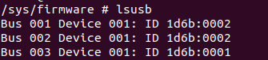
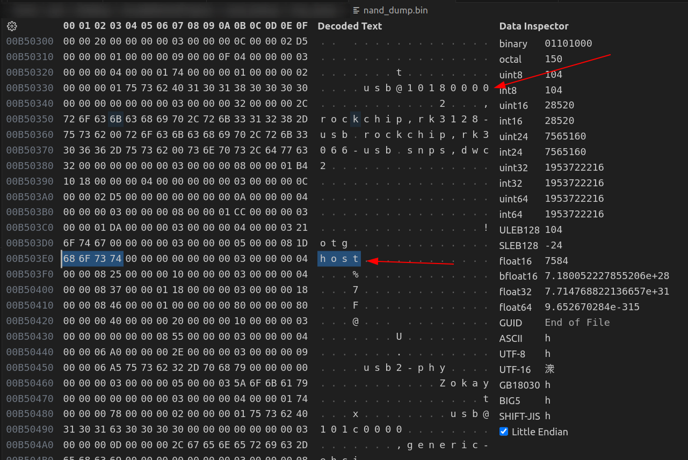
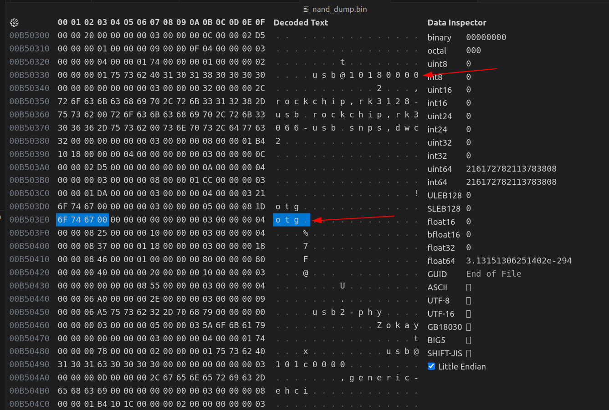
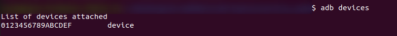
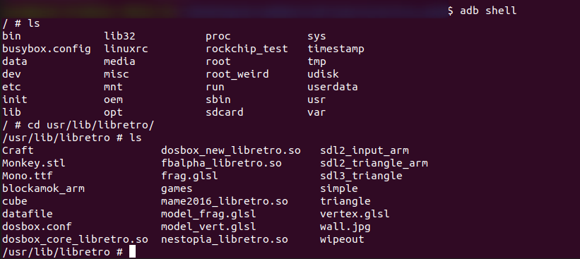

# USB Debug Mode

Currently, our only way to control the console is by providing it commands in the `/etc/init.d/S50ui` file. What would be really nice is to have an interactive terminal on the console so that we can send commands to the console from a separate device. This will also make debugging issues waaayyyy easier.

First we need to dump the flash memory

```bash
sudo rkflashtool r 0 262144 > nand_dump.bin
```


## Finding a USB Terminal

If we take a look in `/etc/init.d` we see a script `S50usbdevice`. Looking inside the script we can see that it is trying setting up an **Android Debug Bridge Daemon** (ADBD) using the USB port. If this works, we should see the console appear as an Android device whenever we connect it to a PC. However, the console is currently not recognized as a device by the PC meaning this **Android Debug Bridge Daemon** is probably not working.

This probably means that the USB driver/device tree entry is missing or the USB is not in the proper mode (we'll get to that later). Running `lsusb` will list the USB devices recognized by the system. Since we're no seeing the **Android Debug Bridge Daemon**, the drivers may not be an issue:




After extracting the device tree from the `.dtb` file located in the nand dump (I won't be covering how to do that here), we see that there are multiple entries for USB devices:

**device_tree.dts**
```
  ...
	usb@10180000 {
		compatible = "rockchip,rk3128-usb\0rockchip,rk3066-usb\0snps,dwc2";
		reg = <0x10180000 0x40000>;
		interrupts = <0x00 0x0a 0x04>;
		clocks = <0x03 0x1da>;
		clock-names = "otg";
		dr_mode = "host";
		g-np-tx-fifo-size = <0x10>;
		g-rx-fifo-size = <0x118>;
		g-tx-fifo-size = <0x100 0x80 0x80 0x40 0x20 0x10>;
		g-use-dma;
		phys = <0x2e>;
		phy-names = "usb2-phy";
		status = "okay";
		phandle = <0x78>;
	};

	usb@101c0000 {
		compatible = "generic-ehci";
		reg = <0x101c0000 0x20000>;
		interrupts = <0x00 0x0b 0x04>;
		clocks = <0x03 0x1d9 0x2f>;
		clock-names = "usbhost\0utmi";
		phys = <0x30>;
		phy-names = "usb";
		status = "okay";
		phandle = <0x79>;
	};
  ...
```

The `dr_mode = "host"` gives us a interesting clue. For a PC to recognize a device, that device cannot be in the `host` mode, it must either be in `peripheral` or `otg` mode. This explains why ADBD was failing, since the console was in `host` mode, PCs (which are typically also in `host` mode) will not recognize it. To fix this we can use the `otg` mode. In the device tree entry for `usb@10180000`, we will have to change `dr_mode = "host"` to `dr_mode = "otg"`.


## Enabling the USB

To do this we will need to modify the device tree within the flash memory. If you've read the [Setup Serial Terminal](SetupSerialTerminal.md) this process will be very similar.

After dumping the flash memory, search for `usb@10180000`. The first match will probably not be what we want. We want to find the `usb@10180000` device tree entry that contains the string `host` (around the 3rd match)


We now need to overwrite `host` with `otg` and replace the **t** in hos**t** with a null byte (0x00). Be careful not to insert additional bytes while writing "otg" (the nand dump file size should be exactly the same before and after you edit).


Now we'll install the `adb` program (`sudo apt install adb` on Linux).


After connecting the conosle to a PC, we can list connected `adb` devices by running the following command on the PC:

`adb devices`



To inititate the debug terminal, run the following command on the PC:

`adb shell`

This should create an interactive shell between the PC and console. Congratulations you know have shell access to the console!

(Your filesystem will not look like the one below, this is a picture from after I added several custom programs to my console)



<div style="display: flex; justify-content: space-between;">
  <a href="README.md" style="text-decoration: none; padding: 10px 20px; background-color: #007BFF; color: white; border-radius: 5px;">&larr; Table of Contents</a>
  <a href="SetupSerialTerminal.md" style="text-decoration: none; padding: 10px 20px; background-color: #007BFF; color: white; border-radius: 5px;">Setup Serial Terminal &rarr;</a>
</div>
