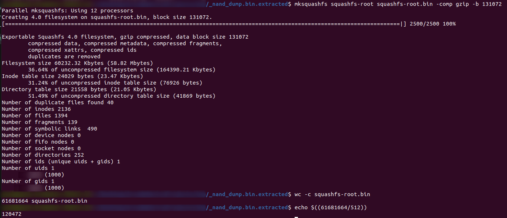

# Writing to Flash
Previously we learned how to read flash memory from the MyArcade Contra console. While checking out the filesystem on the console is cool, what we really want is to be able to modify the filesystem and write that modified filesystem to the flash memory of the console.

**IMPORTANT NOTE:** Writing data to the wrong address with the `rkflashtool` will brick your device (I have already done it with one console) making you unable to flash it again using `rkflashtool`. You will have to manually solder onto the SPI Flash and overwrite it with a microcontroller. 


**IMPORTANT NOTE:** To perform write operations on the flash the console needs to be in Mask ROM Mode, you can enable this by holding down the Volume Up button during boot sequence. You can disable this by rebooting the device. More on this can be found in the [Reading From Flash Memory](ReadingFlash.md) article. 

## Squashing the Filesystem
This console compresses its filesystem using the squashfs. To write our modified filesystem back to the console we first need to squash it using the `mksquashfs` tool.

We can use the following command to compress the **squashfs-root** folder the constitutes the console's filesystem.
```bash
mksquashfs _nand_dump.bin.extracted/squashfs-root squashfs-root.bin -comp gzip -b 131072
```



Before we flash the chip we will need to take note of the size of the `squashfs-root.bin` file. We can use the `wc` command to count the number of bytes in the `squashfs-root.bin` file.

```bash
wc squashfs-root.bin
```

In my case, the `squashfs-root.bin` file was 61681664 bytes.

## Flashing Squashfs to NAND
Now that we have the compressed squashfs binary andfor our modified filesystem, we are ready to update the Flash memory. We will again use `rkflashtool` to modify the flash memory. Remember in the [Reading From Flash Memory](ReadingFlash.md) guide we noted the address that `squashfs` fielsystem starts (address 16777216). To update only the `squashfs` filesystem on the flash memory we need to only overwrite memory starting at that address and we wonly want to write up to the size of our `squashfs-root.bin` file (61681664 bytes).


The write mode for `rkflashtool` takes the following form:

```bash
rkflashtool w <start address> <size of memory>
```

**IMPORTANT NOTE:** Since the flash memory uses blocks of 512 bytes, the **starting address** and **size of memory** we pass need to be divded by 512. (*Ex.* the *starting-address* would be 16777216/512 and our *size of memory* would be 61681664/512) 


```bash
sudo rkflashtool w $((16777216/512)) $((61681664/512)) < squashfs-root.bin
```

To make this whole process simple you can use the following bash script

**UploadFilesystem.sh**
```bash
#!/bin/sh

echo "Squashing filesystem..."

FILESYSTEM_DIR="squashfs-root"
SQUASH_FILENAME="squashfs-root.bin"

# Squash the "filesystem" folder
mksquashfs $FILESYSTEM_DIR $SQUASH_FILENAME -comp gzip -b 131072


# Get the size of the squashed filesystem in 512 chunks
SQUASH_SIZE=$(($(wc -c < $SQUASH_FILENAME)/512))


# Example of a Binwalk output entry for the squashfs filesystem (from my personal console)
# DECIMAL	HEXADECIMAL	  DESCRIPTION
# 16777216      0x1000000       Squashfs filesystem, little endian, version 4.0, compression:gzip, size: 55008974 bytes, 2040 inodes, blocksize: 131072 bytes, created: 2024-05-18 07:35:27
#
#

# Flash NAND memory with new filesystem 
# Memory addresses are multiples of 512 (each 512 bytes is one sector)
echo "Installing filesystem..."
sudo rkflashtool w $((16777216/512)) $SQUASH_SIZE < $SQUASH_FILENAME

echo "Done!"
rm $SQUASH_FILENAME
```

This script expects you have the following file layout:

```
_nand_dump.bin.extracted
    ├── UploadFilesystem.sh
    ├── squashfs-root
    |   ├── bin
    |   ├── data -> userdata
    |   ├── dev
    |   ├── etc
    |   ├── lib
    |   ├── lib32 -> lib
    |   ├── media
    |   ├── mnt
    |   ├── oem
    |   ├── opt
    |   ├── proc
    |   ├── rockchip_test
    |   ├── root_weird
    |   ├── run
    |   ├── sbin
    |   ├── sdcard -> mnt/sdcard
    |   ├── sys
    |   ├── tmp
    |   ├── udisk -> media/usb0
    |   ├── userdata
    |   └── usr
    └── squashfs-root.bin
```

The other files extracted by `binwalk` (such as `1000000.squashfs`) won't impact the **UploadFilesystem.sh**. To use this script you can do the following

```bash
cd _nand_dump.bin.extracted
./UploadFilesystem.sh
```